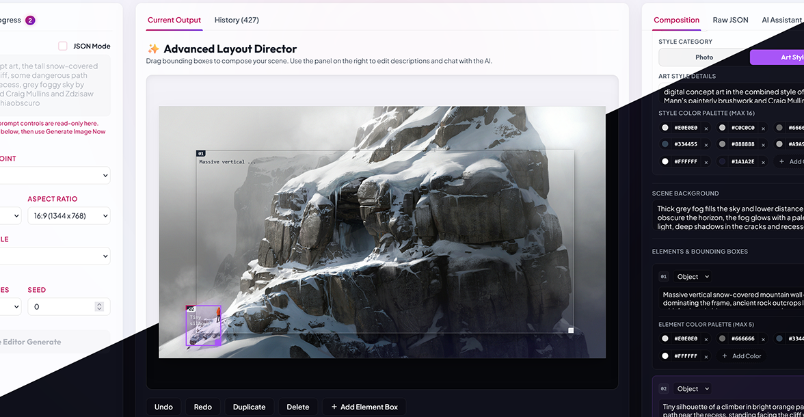

# IdeoUI - Ideogram 4 Studio

IdeoUI is a private, web-based canvas for composing and generating images using Ideogram v4 and DeepSeek. You drag bounding boxes onto a canvas to position visual elements, which the app automatically translates into Ideogram's spatial JSON layout.

*Obviously, this is 100% vibe-coded slop, degraded to a state where human maintainability is nearing 0; stability and updates are not guaranteed; it exists purely to serve my personal needs.*

---

## Key Features

*   **Visual Layout Canvas**: Place, resize, and move bounding boxes to position elements (like text, characters, or objects) exactly where you want them.
*   **Natural Language Layouts**: You don't have to write JSON manually. Write a description of the layout, and DeepSeek will structure it into the correct coordinates and JSON properties for Ideogram.
*   **Interactive JSON Chat**: Chat directly about the generated JSON using natural language to tweak layout settings, shift element positions, or refine details conversationally.
*   **Composition Sidebar**: Customize everything from lighting and art mediums (like 3D renders or photographs) to aesthetic tags and custom color palettes (supporting up to 16 hex colors).
*   **Direct JSON Editing**: If you prefer, you can view and edit the raw layout JSON. The visual canvas updates in real time to reflect your edits, and vice versa.
*   **Streaming Previews**: The interface displays real-time generation progress and intermediate image previews streamed directly from the runner over WebSockets and SSE.
*   **History & Lightbox**: Every generation is saved locally in an SQLite or PostgreSQL database, allowing you to browse past runs, inspect them in a lightbox, or load them back to iterate further.
*   **Server-Side State Management**: Active session and workspace state are stored on the server. This makes it easy to access your workspace across multiple devices, though layouts for smaller screens are not supported yet.
*   **Input Synchronization**: State management is handled with debouncing and input locking, which avoids UI lag or race conditions while typing or dragging elements.

---

## UI Walkthrough

The workspace layout is split into three main areas:



1.  **Left Sidebar (Inference & Presets)**: Configure basic generation settings, like aspect ratios, seeds, and toggles.
2.  **Central Canvas**: The visual editor where you can drag and resize bounding boxes to lay out your image. Underneath the canvas, there are buttons for undo, redo, duplicating, deleting, or adding new elements. You can also switch between the active workspace view and the history browser.
3.  **Right Sidebar**: This panel handles details. Under the **Composition** tab, you can write descriptions, set lighting, select styles, and customize the color palette. The **JSON** tab lets you edit the raw layout payload directly.

---

## Repository Layout

Here is how the project is structured:

```
├── frontend/                   # Lit + Vite frontend application
├── backend/                    # FastAPI backend and DB schemas
│   └── migrations/             # Alembic migration history
├── config/
│   ├── config.example.toml     # Template configuration file
│   ├── config.toml             # Your local configuration (git-ignored)
│   ├── providers/              # TOML configurations for DeepSeek and generation endpoints
│   └── upsample-prompts/       # System prompts for upsample templates (e.g. v1, v4)
├── static/                     # Built frontend assets served by the backend
├── docs/
│   ├── architecture.md         # High-level system architecture overview
│   ├── engine.md               # Documentation for the TOML-driven generic provider engines
│   └── docker.md               # Docker and Docker Compose deployment guide
├── server.py                   # Main entry point to run the FastAPI server
├── alembic.ini                 # Migration config
└── pyproject.toml              # Python dependencies
```

## TOML-Driven Generic Provider System

IdeoUI features a modular, configuration-driven system for integrating image generation and LLM upsampling backends. Instead of hardcoding API classes, all selectable providers are defined in `.toml` files located under `config/providers/` and resolved dynamically.

For detailed documentation on the architecture, templating namespaces (`{{auth}}`, `{{inputs}}`, `{{runtime}}`), and customization schemas, please see [docs/engine.md](docs/engine.md). A high-level overview of the system architecture is available in [docs/architecture.md](docs/architecture.md).

---

## Installation & Setup

### Prerequisites

You will need:
*   **Python** (version 3.11 or newer)
*   **Node.js** (LTS version)
*   **uv** (recommended for managing Python packages) and **npm**

### 1. Configuration

Create your configuration file by copying the template:

```bash
cp config/config.example.toml config/config.toml
```

Open `config/config.toml` and fill in your settings, such as your database URL, DeepSeek API key, and image generation backend credentials.

### 2. Backend Setup

Install the backend dependencies and set up the virtual environment:

```bash
uv sync
```

### 3. Frontend Setup

Navigate to the frontend directory and install the Node packages:

```bash
cd frontend
npm install
```

---

## Running the App Locally

### Docker Deployment

For instructions on deploying the application and a local S3 storage mock using Docker and Docker Compose, please read [docs/docker.md](docs/docker.md).

### Development Mode (Frontend & Backend)

To run both the Vite development server (port 5173) and the FastAPI backend (port 8000) concurrently with hot-reloading:

```bash
cd frontend
npm run dev
```

### Standalone Backend

If you only want to run the FastAPI service (for example, if you are serving pre-built assets or using an external frontend):

```bash
uv run python -u server.py
```

### Building for Production

To build the frontend and bundle the assets into the backend's static directory:

```bash
cd frontend
npm run build
```

---

## Verification

To quickly check that the Python backend imports correctly and compiles without issues, you can run:

```bash
uv run python -m compileall backend backend/migrations/versions
uv run python -c "import backend.main; print('backend import ok')"
```

---

## Security & Deployment

*   **Authentication**: IdeoUI is built as a single-user private studio and does not have built-in authentication. If you plan to expose it to the internet, make sure to set up basic auth, a reverse proxy, or VPN access.
*   **Database Migrations**: The server runs database migrations automatically on startup using Alembic. You can change the database connection details in your `config.toml`.
